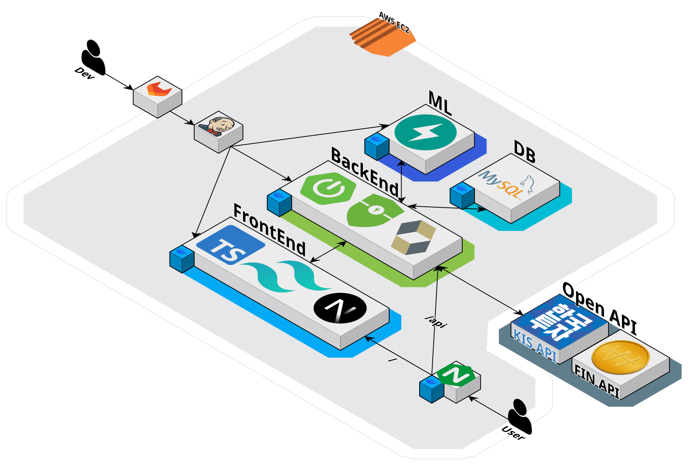
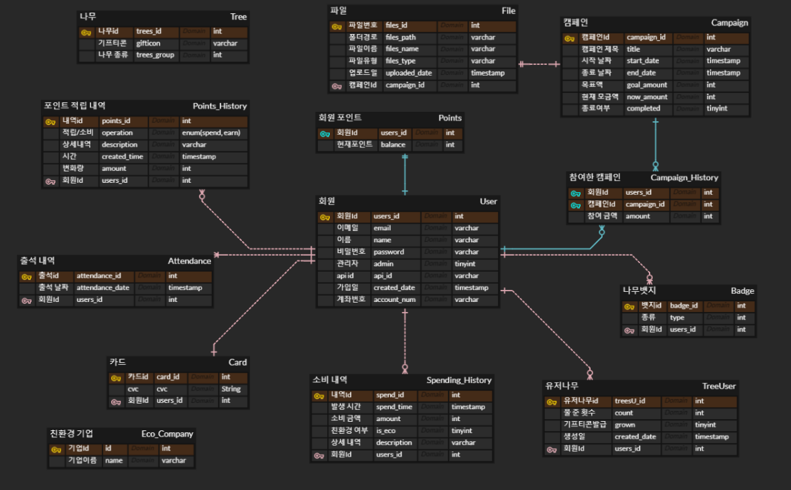

# 🍃 에코핑

**2024.08.19 (월) ~ 2024.10.11 (금)**  
**삼성 청년 소프트웨어 아카데미 11기 2학기 특화 프로젝트**

## 팀원 구성

| 　　 **강성구👑**　 | 　　**박진형** 　　 | 　　**이동엽**　　 | 　　**정해준**　　 | 　　**박상용**　　 | 　　**안홍찬**　　 |
| :-----------------: | :-----------------: | :----------------: | :----------------: | :----------------: | :----------------: |
|      **BACK**       |      **BACK**       |      **BACK**      | **BACK/ML/INFRA**  |     **FRONT**      |     **FRONT**      |

## 기획 배경

**개요**  
Fin-Tech와 친환경적 요소를 결합한 프로젝트입니다.  
기부, 모의토자, 카드 등의 친환경 서비스를 구현하였습니다.

**목적**  
보통 ESG는 기업만 실천한다는 조사 결과가 있습니다.  
하지만 이제는 소비자들도 이러한 ESG 활동에 관심을 가지기 시작했습니다.  
이를 반영해, **소비자도 ESG 활동에 동참한다는 느낌**을 줄 수 있도록 프로젝트를 기획하였습니다.

## 서비스 구조

### 아키텍쳐

### ERD

### 주요 기술

**개발 환경**

**Development**

  

**ML**  

**INFRA**

**협업**

## 서비스 기능

## 후기

**성구**

> 11

**상용**

> 22

**홍찬**

> 모의 MTS를 만드는 과정에서 직접 Mysql을 통해 db도 다뤄보고, 친환경 index도 만들면서 sklearn을 통한 회귀분석도 진행해볼 수 있었다.
> 
> 프론트엔드를 위주로 맡게 되면서 이론적으로 배우고 지나간 부분에 대해 프로젝트에서 직접 해 볼 기회가 없었는데 이번 기회를 통해 백부터 프론트까지 전반적인 과정을 직접 경험해본 것이 앞으로 큰 자산이 될거라 생각한다.
> 
> 프론트와 백 모두 같은 기능을 구현하는 데 있어 서로 다른 요구사항이 존재할 수 있음을 이번 프로젝트에서 많이 느꼈고, 대화를 통해 적절히 조화를 이루어나가는 게 중요하다는 것을 깨달았다.
> 
> MTS 구현 과정에서 API를 1초에 20번까지만 전송할 수 있다는 점 때문에 상당히 제한적인 상황에서 개발을 진행한 것이 매우 아쉽게 느껴졌다.

**해준**

> 44

**동엽**

> 55

**진형**

> 66
